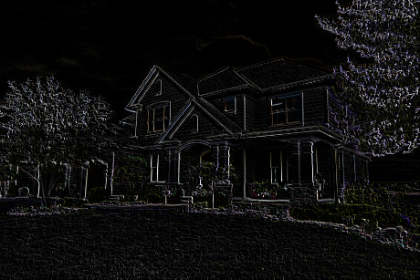
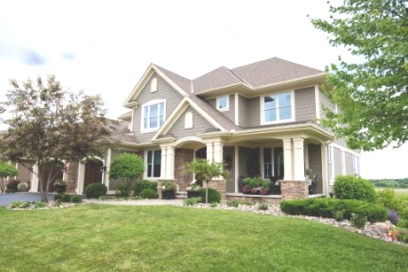
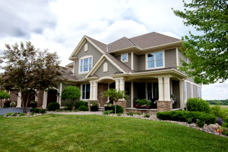

# rustImageProcessing
Implementation of various image processing algorithms in Rust

# Examples
Baseline house image (source: https://www.housebeautiful.com/lifestyle/a31897953/buying-house-coronavirus/):

House image with edge detection:

With brightness increased:

With contrast increased:

Baseline face image:

Baseline face image sharpened (overly sharpened to make the effect obvious):

Baseline face image with gaussian blur:

